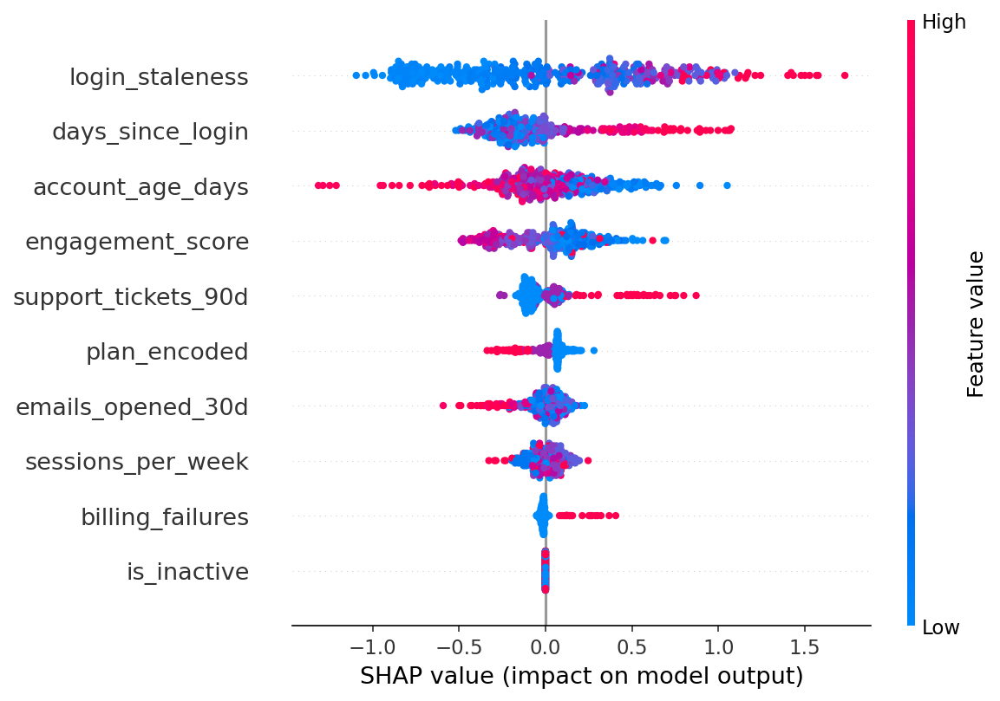

# Customer-Churn-Predictor-for-Subscription-Service


Predicts whether a subscriber will churn in the next 30 days based on their engagement behavior. Built with XGBoost + SHAP for interpretability.

Core Idea: marketing teams don't only want a churn flag, but they also want to know *why* someone is at risk so they can act on it (send a win-back email, offer a discount, flag for a sales call, etc).

---

## Project Structure

```
churn-predictor-for-subscription-service/
├── data/
│   ├── generate_data.py      # generates a synthetic subscriber dataset
│   └── subscribers.csv       # output (2000 rows by default)
├── src/
│   ├── features.py           # feature engineering
│   ├── train.py              # trains model, saves the model and SHAP plot
│   └── predict.py            # CLI: input a subscriber, get churn probability
├── model/
│   └── churn_model.pkl
├── plots/
│   └── shap_summary.png
└── requirements.txt
```

---

## Quickstart

```bash
pip install -r requirements.txt

# generate the dataset
cd data
python generate_data.py

# train the model
cd ../src
python train.py

# predict churn for a subscriber
python predict.py --plan free --days_since_login 21 --emails_opened 0 --sessions_per_week 1
```

---

## Model Performance

Evaluated on a held out 20% test set (400 subscribers).

| Metric | Score |
|---|---|
| ROC-AUC | 0.69 |
| Accuracy | 0.63 |
| Precision (churn) | 0.61 |
| Recall (churn) | 0.60 |

The dataset has about 46% churn rate which is relatively high. This is intentional to simulate a struggling subscription product where churn is a real problem.

---

## CLI Usage

```bash
python predict.py \
  --plan free \
  --days_since_login 30 \
  --emails_opened 0 \
  --sessions_per_week 0 \
  --billing_failures 1

# Churn probability : 74%
# Risk level        : HIGH
# Top reason        : account activity has dropped off
```

```bash
python predict.py \
  --plan pro \
  --days_since_login 2 \
  --emails_opened 12 \
  --sessions_per_week 7

# Churn probability : 48%
# Risk level        : MEDIUM
# Top reason        : low overall engagement
```

All CLI arguments:

| Argument | Type | Default | Description |
|---|---|---|---|
| `--plan` | str | required | `free`, `basic`, or `pro` |
| `--days_since_login` | int | required | days since last login |
| `--emails_opened` | int | 0 | emails opened in last 30 days |
| `--sessions_per_week` | int | 1 | average weekly sessions |
| `--support_tickets` | int | 0 | tickets filed in last 90 days |
| `--billing_failures` | int | 0 | number of billing failures |
| `--account_age_days` | int | 180 | total account age in days |

---

## SHAP Feature Importance

SHAP (SHapley Additive exPlanations) shows which features push predictions toward churn or retention. This is the output a marketing analyst would actually use to prioritize intervention strategies.



`days_since_login` and `login_staleness` (how inactive the account is relative to its age) are the strongest churn signals. `billing_failures` has high impact when present even though it's rare.

---

## Features Used

| Feature | Description |
|---|---|
| `plan_type` | encoded as free=0, basic=1, pro=2 |
| `days_since_login` | raw inactivity signal |
| `emails_opened_30d` | email engagement |
| `sessions_per_week` | product usage frequency |
| `support_tickets_90d` | frustration signal |
| `billing_failures` | payment issues |
| `account_age_days` | subscriber tenure |
| `login_staleness` | days_since_login / account_age (engineered) |
| `engagement_score` | emails + sessions * 2 (engineered) |
| `is_inactive` | 1 if days_since_login > 14 (engineered) |

---

## Notes

- The dataset is synthetic but built with realistic correlation structure (e.g. - pro plan users login more frequently, billing failures are rare but impactful)
- Model is XGBoost with light tuning, not heavily optimized, which makes it more about the pipeline than squeezing out AUC
- SHAP values are computed per-prediction so the "top reason" output in the CLI is always specific to that subscriber, not global feature importance.
